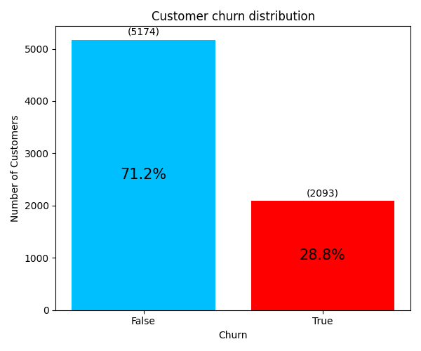

# **Telecom X - Análise de Evasão de Clientes**
# Introdução:

 A empresa Telecom X, enfrenta um alto índice de cancelamentos e precisa entender os fatores que levam à perda de clientes.
 O Objetivo desse estudo é transformar dados brutos em informações estratégicas e ajudar a Telecom X a reter mais clientes.

# Limpeza e Tratamento de Dados:
*  Os dados foram obtidos em formato JSON. 
*  Aplicou-se uma transformação para "achatar" (flatten) o JSON em formato tabular, facilitando a leitura e análise.
*  Também foi realizada a correção da tipagem: algumas colunas apresentavam valores numéricos ou booleanos armazenados como texto.
*  Padding: Algumas linhas continham colunas com dados nulos. Para não descartar as informações válidas dessas linhas, foi atribuído um valor padrão, dependendo da categoria da coluna.

# Análise Exploratória de Dados:
## Gráfico para visualizar a proporção de clientes que permaneceram e os que saíram (Churn).

# Gráficos para visualizar Evasão por Variáveis Categóricas.

# Gráficos para visualizar Contagem de Evasão por Variáveis Numéricas (BoxPlot)

# Gráficos para visualizar Evasão ao longo do tempo de contrato:

# Análise por Correlação (Pandas)
 Uma boa maneira de verificar se uma variável afeta outra é calcular a correlação entre elas. Para isso, algumas transformações foram aplicadas aos dados para viabilizar o cálculo.
 foi aplicado algumas transformações aos dados para possibilitar o calulo.
*  Remoção da coluna customerID.
*  Conversão de todas as colunas para formatos numéricos/booleanos, evitando valores textuais. Alguns valores categóricos foram transformados em colunas próprias com pd.get_dummies.
 Após essas etapas, foi possível calcular a correlação entre as variáveis utilizando .corr().
# Gráfico de correlação com a variável Churn

# (Extra) Análise de Correlação com Todas as Variáveis (Dython)
 Usando a biblioteca dython, basta remover a coluna CustomerID, pois as demais transformações são realizadas automaticamente pela função associations().

# Grafico da Matriz de correlação (Todas as variaveis).

# Interpretação da força da correlação:
*  |r| ≥ 0.7: Correlação forte ou muito forte.
*  |r| ≥ 0.5 e < 0.7: Correlação moderada.
*  |r| ≥ 0.3 e < 0.5: Correlação fraca.
*  |r| < 0.3: Correlação muito fraca ou desprezível. 

# Conclusões e Insights

*  A evasão (Churn) apresenta correlação fraca positiva com o tipo de contrato (Contract), sendo o mensal (Monthly) o que apresenta maior quantidade de cancelamentos.

*  O mesmo padrão se repete com o tipo de serviço de internet, onde clientes com fibra óptica tendem a evadir mais, e com o método de pagamento, sendo o cheque eletrônico o mais associado à evasão.

*  Os boxplots indicam que clientes que pagam valores mais altos mensal ou diariamente tendem a evadir com mais frequência.

*  No gráfico da evasão ao longo do tempo, nota-se um pico de cancelamentos nos primeiros meses.

## Conclusão:
 Clientes com maior propensão a cancelar o serviço geralmente usam fibra óptica, preferem pagamento mensal e o fazem nos primeiros meses de uso.

## Recomendações:
### 1. Criação de campanhas de retenção nos primeiros meses
- **Justificativa**: A evasão ocorre majoritariamente nos meses iniciais do contrato.
- **Ação recomendada**: Implementar onboarding personalizado, ofertas promocionais e suporte dedicado nos primeiros 3 meses.

### 2. Revisão do plano mensal (Monthly Contract)
- **Justificativa**: Clientes com contrato mensal apresentam maior taxa de evasão.
- **Ação recomendada**: 
  - Oferecer **incentivos financeiros** para migração para contratos mais longos (trimestrais ou anuais).
  - Educar o cliente sobre os **benefícios de planos de fidelidade** com atendimento ou vantagens exclusivas.

### 3. Análise da experiência com o serviço de fibra óptica
- **Justificativa**: Usuários de fibra óptica estão entre os que mais cancelam o serviço.
- **Ação recomendada**:
  - Avaliar a **qualidade real do serviço prestado** em regiões com alto churn.
  - Realizar **pesquisas de satisfação específicas** com usuários de fibra óptica para identificar causas ocultas (instabilidade, suporte, instalação etc).

### 4. Ajuste na política de preços
- **Justificativa**: Clientes que pagam mais têm maior propensão à evasão.
- **Ação recomendada**:
  - Oferecer **planos intermediários** ou **customizados** para perfis com menor elasticidade de preço.
  - Criar programas de **cashback ou fidelidade** baseados no valor gasto.

### 5. Melhoria na comunicação com usuários de cheque eletrônico
- **Justificativa**: Pagadores via cheque eletrônico possuem maior taxa de evasão.
- **Ação recomendada**:
  - Promover **métodos de pagamento mais modernos** (PIX, débito automático).
  - Oferecer **descontos ou benefícios** para quem migrar para formas digitais.

# Tecnologias Utilizadas:
- Python (3.12.7)
- Pandas
- Numpy
- Vscode
- Dython
- Git e Github